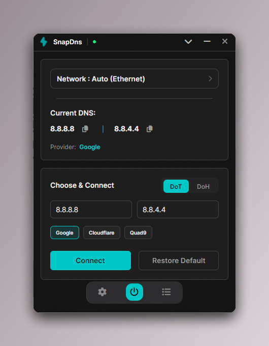
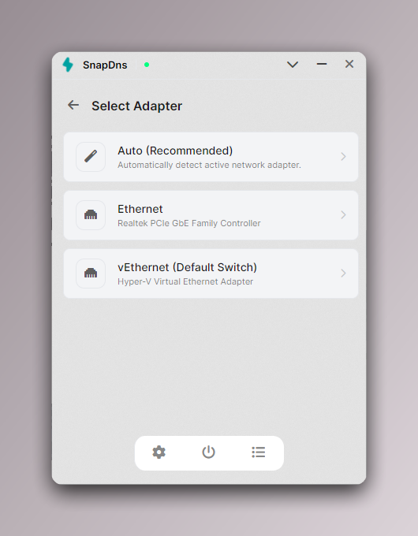

<div align="center">

  

  # SnapDNS
  **Change your DNS settings without digging through Control Panel.**

  [](LICENSE.txt)
  
  

</div>

---

## What is it?

**SnapDNS** is a desktop tool that lets you switch your DNS providers (Google, Cloudflare, Quad9) quickly.

It solves the issue of Windows 10 not natively supporting **DNS-over-HTTPS (DoH)** for custom providers by running a lightweight local proxy in the background. It creates a system service to handle the network changes, so the UI doesn't need to run as Administrator.

## Screenshots

<div align="center">
  
  
</div>

## Features

*   **DNS-over-HTTPS (DoH):** Uses a local proxy to enable encrypted DNS on Windows 10/11.
*   **Auto-Detect:** Finds your active network adapter automatically (Wi-Fi or Ethernet).
*   **Profiles:** Comes with Cloudflare, Google, and Quad9 preset. You can add your own.
*   **System Tray:** Closes to the tray so it stays out of your way.
*   **Utilities:**
    *   **Flush DNS:** Runs `ipconfig /flushdns` with one click.
    *   **Latency Check:** Pings the server before you connect.
    *   **Leak Test:** Shortcut to open dnsleaktest.com.

---

## Installation

### Windows
1.  Go to **[Releases](https://github.com/VindEi/SnapDNS/releases)**.
2.  Download `SnapDns_Setup.exe`.
3.  Run the installer. It will register the background service automatically.

### Linux / macOS
*Currently source-only. Binary releases pending.*

---

## How It Works

SnapDNS uses a split architecture to handle permissions securely:

1.  **SnapDns.App (UI):** The interface you see. It runs with standard user permissions.
2.  **SnapDns.Service (Backend):** A background service running as `LocalSystem`.
    *   The UI sends commands to the Service via Named Pipes.
    *   The Service executes the actual network changes (WMI/Netsh).
    *   If DoH is selected, the Service spins up a local UDP proxy on `127.0.0.1:53` and tunnels requests over HTTPS.

---

## Building from Source

**Requirements:**
*   [.NET 8.0 SDK](https://dotnet.microsoft.com/en-us/download/dotnet/8.0)

```bash
# 1. Clone
git clone https://github.com/VindEi/SnapDNS.git
cd SnapDNS

# 2. Build & Publish Service (Self-Contained)
dotnet publish SnapDns.Service -c Release -r win-x64 --self-contained true /p:PublishSingleFile=true

# 3. Build & Publish App (Framework Dependent)
dotnet publish SnapDns.App -c Release -r win-x64 --self-contained false
