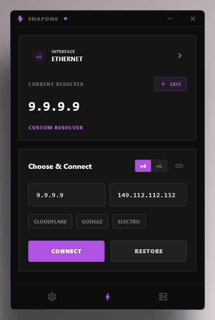
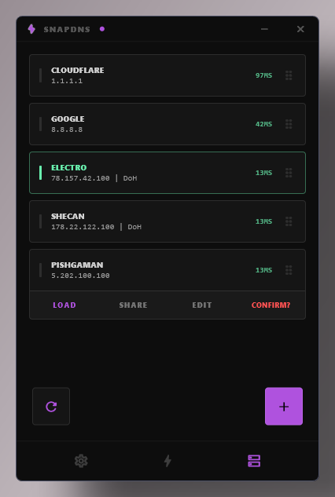
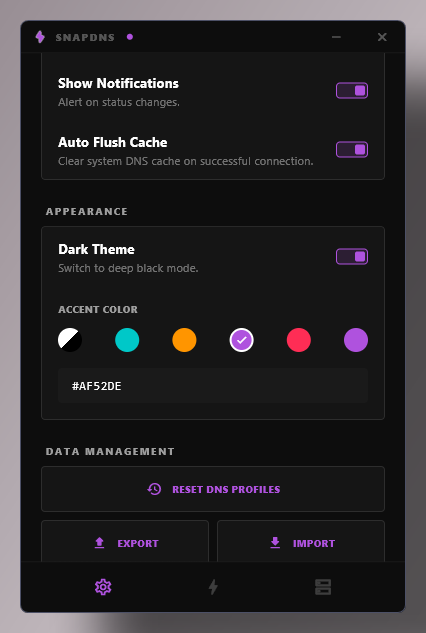

# ⚡ SnapDNS

<p align="center">
  
  
  
  
  
</p>

<p align="center">
  
</p>

<p align="center">
  <b>A lightweight, beautiful , secure, cross-platform DNS manager.</b><br>
  Manage secure DNS protocols, profile benchmarks, and system network interfaces instantly without administrative credential prompts on every change.
</p>

---

## ✨ Features

- 🔒 **Secure Protocol Implementation (DoH / DoT):** Enforces DNS-over-HTTPS (DoH) and DNS-over-TLS (DoT) system-wide. On desktop, this is managed via a local loopback proxy (`127.0.0.1:53`); on Android, it is managed via a native split-tunnel `VpnService`.
- ⚡ **Administrative Privilege Separation:** Employs a decoupled architecture where an unprivileged UI client communicates with a secure background service. This allows standard users to apply global DNS changes instantly without UAC or sudo prompts during active use.
- 📊 **Active Latency Benchmarking:** Evaluates resolver performance directly by measuring query round-trip times, helping you identify and switch to the fastest unblocked path.
- 📋 **Integrated Auto-Fill Parser:** Instantly parses and configures raw DNS IP addresses, secure URLs, or shared configuration profiles directly from your clipboard.

---

## ⚙️ System Mechanics & Proxy Architecture

To understand how SnapDNS resolves secure protocols on desktop and mobile without introducing latency, system hangs, or leaks, the platform-specific backends operate under the following mechanics:

### 🖥️ Desktop C# Proxy Engine (Windows, Linux, macOS)
The C# background service runs as a system daemon and serves as a low-overhead DNS proxy on loopback Port `53`.

```text
  [ Local Application Query ] 
             │ (Port 53 UDP)
             ▼
    [ C# Proxy Listener ]
             │
             ├─► DoH Route ──► [ SocketsHttpHandler ] ──► (POST application/dns-message)
             │
             └─► DoT Route ──► [ Persistent SslStream ] ─► (RFC 7858 TLS Port 853)
```

1. **UDP Socket Loop & Connection Resilience:**
   The proxy binds to `127.0.0.1:53` using an asynchronous `UdpClient`. Under Windows, if a UDP packet is sent to a closed remote port, the OS receives an ICMP "Port Unreachable" packet and propagates a `SocketException` (10054 / `WSAECONNRESET`) on the next receive call. SnapDNS applies a Windows-specific `IOControl` configuration (`SIO_UDP_CONNRESET`) to ignore connection resets, preventing socket-rebind loops and connection drops.
2. **DNS-over-HTTPS (DoH) Pipeline:**
   Incoming UDP queries are marshaled into standard `application/dns-message` MIME payloads. They are sent via an `HttpClient` instance configured with a `SocketsHttpHandler` utilizing `PooledConnectionLifetime`. This enforces efficient TCP connection pooling, eliminating the overhead of raw socket handshakes for subsequent HTTP POST queries.
3. **DNS-over-TLS (DoT) Pipeline:**
   Incoming UDP queries are prefixed with a 2-byte Big-Endian length header (RFC 7858) and forwarded over a persistent `SslStream` on Port 853. Write-and-read operations are serialized using `SemaphoreSlim` to prevent packet interleaving, allowing multiple concurrent client lookups to safely reuse a single active TLS tunnel.
4. **Bootstrap Resolution & Deadlock Prevention:**
   When the target adapter's primary DNS is set to `127.0.0.1`, attempting to resolve a secure hostname (e.g., `cloudflare-dns.com`) using standard system APIs triggers a recursive circular lookup deadlock. To bypass this, the C# engine uses a lightweight, custom, zero-dependency UDP resolver to query root servers (`1.1.1.1` and `8.8.8.8`) directly, acquiring the bootstrap IP address of the secure host before spawning the HTTPS/TLS stream.
5. **Windows IPv6 Leak Block:**
   Windows heavily prioritizes active DHCP-assigned IPv6 DNS servers over local IPv4 loopbacks (`127.0.0.1`). When setting the IPv4 DNS to loopback, the C# service automatically purges all IPv6 DNS configurations on the target interface using `netsh interface ipv6 delete dnsservers` to force all DNS traffic through the secure proxy.

---

### 📱 Android DNS Forwarding Tunnel (Mobile)
On Android, SnapDNS configures a virtual split-tunnel network interface (`10.0.0.2` via `VpnService`).

```text
  [ Android Application Query ]
                │
                ▼
  [ Virtual TUN Interface (10.0.0.1/32) ]
                │ (FileInputStream Block Read)
                ▼
  [ Kotlin VpnService Engine ]
                │ (Thread Pool Workers)
                ├─► DoH ──► [ HttpsURLConnection ] ──► (POST payload)
                │
                └─► DoT ──► [ Reusable SSLSocket ] ───► (Enforces SNI + Hostname Verification)
```

1. **Packet Injection & Multi-Threaded Worker Pool:**
   A local TUN interface is established with a `/32` route forcing Windows-equivalent loopback routing. A background thread processes incoming packets from a blocking `FileInputStream`. It parses IPv4/UDP headers synchronously and hands off payload resolution asynchronously to a multi-threaded worker pool (`Executors.newFixedThreadPool`) to maximize throughput.
2. **TLS Hostname Verification:**
   DoT queries are written to a native `SSLSocket` on Port 853. The Kotlin client explicitly defines Server Name Indication (SNI) and applies strict hostname verification using `endpointIdentificationAlgorithm = "HTTPS"`. This protects mobile connections against public middle-man attacks on public Wi-Fi networks.
3. **Android Bootstrap Resolution:**
   To bypass similar circular deadlocks inside the mobile VPN environment, the Flutter Dart layer pre-resolves the secure domain name using the active network connection *before* the native VPN service initiates. It then passes the pre-resolved IP list directly down the `MethodChannel`, allowing the Kotlin service to establish instant TLS handshakes using direct IP endpoints.

---

## 📸 Screenshots

<p align="center">
  
  
  
</p>

---

## 📥 Downloads

| OS                | Format             | Description                                                              |
| :---------------- | :----------------- | :----------------------------------------------------------------------- |
| **Windows 10/11** | `.exe` (Installer) | Installs both the app and the background system service. *(Recommended)* |
| **Windows 10/11** | `.zip` (Portable)  | Standalone portable folder. Requires manual service setup.               |
| **macOS / Linux** | `.zip` (Portable)  | Standalone app folders for macOS and Linux users.                        |
| **Android**       | `.apk`             | Standard Android installer. Requires Android 7.0+.                       |

---

## 🚀 Installation & Setup

### Windows (Desktop)

1. Download the latest `SnapDNS_Windows_x64_Portable.zip` from the Releases section.
2. Extract the archive to your preferred directory.
3. Right-click `install_windows.bat` and select **"Run as Administrator"** to register and launch the background service.
4. Launch `snapdns.exe`.

### macOS / Linux

1. Download the portable archive matching your platform.
2. Extract the files.
3. Open a terminal inside the extracted directory and run the helper installer:

   ```bash
   # On Linux
   sudo ./install_linux.sh

   # On macOS
   sudo ./install_mac.command
   ```

4. Double-click the `snapdns` app to launch it.

### Android (Mobile)

1. Download the compiled `.apk` to your phone.
2. Install the APK (allow "Install from Unknown Sources" if prompted).
3. Select any profile and click **Connect**. Grant the system permission to run the local tunnel when asked.
4. *(Optional)* Pull down your notification bar, edit your Quick Tiles, and drag the **SnapDNS** tile to your quick-toggle menu.

---

## <details><summary>🛠️ Building from Source</summary>

### Prerequisites

- Flutter SDK
- .NET SDK
- C++ Desktop Development tools (Visual Studio on Windows, Clang/GCC on Linux, Xcode on macOS)

### 1. Compile the Standalone background Service (C#)

```bash
# For Windows
dotnet publish SnapDns.Service.csproj -c Release -r win-x64 --self-contained true -p:PublishSingleFile=true -p:PublishTrimmed=true

# For Linux
dotnet publish SnapDns.Service.csproj -c Release -r linux-x64 --self-contained true -p:PublishSingleFile=true -p:PublishTrimmed=true

# For macOS (Apple Silicon)
dotnet publish SnapDns.Service.csproj -c Release -r osx-arm64 --self-contained true -p:PublishSingleFile=true -p:PublishTrimmed=true
```

### 2. Compile the Flutter User Interface

```bash
# Move to the UI directory
cd ../SnapDns_UI
flutter pub get

# Build target
flutter build windows --release
# OR
flutter build linux --release
# OR
flutter build macos --release
# OR
flutter build apk --release --split-per-abi
```

</details>

---

## 🤝 Contributing, Bugs & Feature Requests

Contributions from the developer and user communities are welcome. If you find a bug, encounter a routing issue, or want to suggest new features, please use the following guidelines:

### Encountering an Issue?
1. Check the [GitHub Issues](https://github.com/VindEi/SnapDNS/issues) tab to see if the bug has already been reported.
2. If it is a new issue, open a bug report. Please include:
   * Your active operating system (Windows version, Linux distribution, macOS version, or Android API level).
   * Detailed steps to reproduce the issue.
   * Relevant service output logs (C# console/service output or Android Logcat) to help isolate the socket, process, or protocol failures.

### Want to Add Features?
1. Open a **Feature Request** issue to discuss your proposal first, ensuring it aligns with the project's decoupled privilege architecture.
2. Fork the repository, create a descriptive branch, and implement your changes.
3. Open a **Pull Request** targeting the `main` branch. Ensure that:
   * Changes remain completely cross-platform and respect the separation of C# (service-space) and Dart (user-space) layers.
   * Code compiles warning-free under both Flutter and .NET analyzers before submission.

---

## 🛠️ Troubleshooting & Support

- **"Service Offline" on Windows:** Right-click the `install_windows.bat` file in your SnapDNS folder and select **Run as Administrator** to re-register the background system service.
- **DNS not changing on macOS/Linux:** Ensure you run your platform installation script (`install_linux.sh` or `install_mac.command`) using `sudo` to register the system daemon.

## 📄 License

This project is licensed under the **GNU General Public License v3.0 (GPL-3.0)** - see the [LICENSE](LICENSE) file for details.
